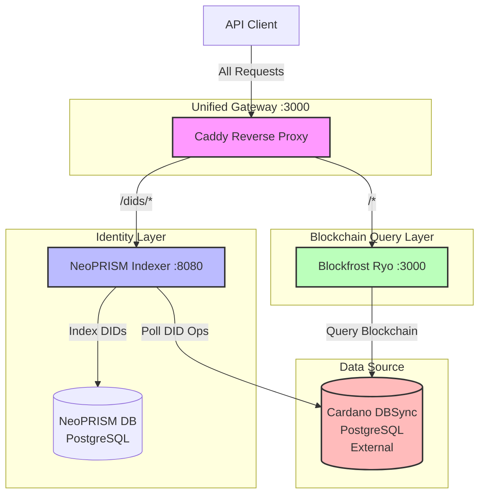

# Blockfrost NeoPRISM Demo

Proof-of-concept demonstrating how to extend [Blockfrost API](https://blockfrost.io/) with DID resolution capabilities through NeoPRISM integration. This setup uses a reverse proxy to route DID requests to NeoPRISM while forwarding blockchain queries to Blockfrost's backend (Ryo), presenting a unified API surface to clients.

## Overview

This deployment demonstrates the integration pattern between Cardano infrastructure providers and decentralized identity services. Rather than running a full Cardano node and DBSync indexer, this setup leverages an existing DBSync database to provide both blockchain query capabilities (via Blockfrost Ryo) and DID resolution services (via NeoPRISM) through a single endpoint.

**Key characteristics:**
- **Unified API Gateway**: Single entry point for both Blockfrost and DID resolution APIs
- **Shared Data Layer**: Both Ryo and NeoPRISM connect to the same DBSync database
- **Minimal Infrastructure**: No Cardano node required; leverages existing DBSync instance
- **Production-Ready Pattern**: Demonstrates how identity services integrate with blockchain infrastructure

## Quick Start

### Prerequisites

- Docker and Docker Compose
- Access to a Cardano DBSync database (mainnet or testnet)
- DBSync connection credentials

### 1. Configure Environment

Copy the environment template and configure DBSync connection parameters:

```sh
cd docker/blockfrost-neoprism-demo
cp .env.template .env
```

Edit `.env` with your DBSync connection details:

### 2. Start Services

```sh
docker compose up -d
```

Services will be available at:

| Service | URL | Description |
|---------|-----|-------------|
| **Unified API Gateway** | http://localhost:3000 | Single entry point for all requests |
| **NeoPRISM API** | http://localhost:8080 | Direct access to DID resolver (internal) |

### 3. Verify Deployment

Check service health:

```sh
# Via unified gateway
curl http://localhost:3000/dids/_system/health
```

## Usage Examples

### DID Resolution

Resolve a PRISM DID through the unified gateway:

```sh
curl http://localhost:3000/dids/did:prism:<did-suffix>
```

Example response:
```json
{
  "@context": "https://w3id.org/did-resolution/v1",
  "didDocument": {
    "@context": ["https://www.w3.org/ns/did/v1"],
    "id": "did:prism:...",
    "verificationMethod": [...],
    ...
  },
  "didDocumentMetadata": {...}
}
```

### Finding Example DIDs

You can browse and discover example DIDs using the NeoPRISM web interface:

1. Open the explorer in your browser: http://localhost:8080/explorer
2. Navigate through the indexed DIDs to find examples
3. Copy any DID identifier to use in the resolution examples above

The web interface provides a convenient way to explore all DIDs that have been indexed from the Cardano blockchain, making it easy to test the resolution API without needing to know specific DID identifiers beforehand.

## Architecture



### Components

#### Caddy (Reverse Proxy)
- **Port**: 3000
- **Function**: Routes requests based on path patterns
- **Routing Rules**:
  - `/dids/*` → NeoPRISM (DID resolution)
  - `/*` → Blockfrost Ryo (blockchain queries)

#### NeoPRISM Indexer
- **Port**: 8080 (internal), 3000 (via gateway)
- **Mode**: Indexer (read-only DID resolution)
- **Function**: 
  - Polls DBSync for PRISM DID operations
  - Validates and indexes DID state changes
  - Serves W3C-compliant DID resolution requests
- **Storage**: Dedicated PostgreSQL database for DID state

#### Blockfrost Ryo
- **Port**: 3000 (internal)
- **Function**: Provides Blockfrost-compatible API endpoints for blockchain queries
- **Data Source**: Connects directly to DBSync database

#### PostgreSQL (NeoPRISM)
- **Port**: 5432 (internal)
- **Function**: Stores indexed DID documents and operational state
- **Note**: Separate from DBSync; only stores DID-specific data

### Data Flow

1. **DID Indexing**:
   - NeoPRISM polls DBSync at configured intervals (default: 10 seconds)
   - Discovers PRISM DID operations in transaction metadata
   - Validates operations according to PRISM protocol rules
   - Updates DID state in NeoPRISM database

2. **DID Resolution**:
   - Client requests DID via `/dids/did:prism:...`
   - Caddy routes to NeoPRISM indexer
   - NeoPRISM retrieves current DID state from its database
   - Returns W3C-compliant DID Document

## Configuration

### Environment Variables

- `DBSYNC_HOST`: DBSync PostgreSQL hostname
- `DBSYNC_PORT`: DBSync PostgreSQL port (default: 5432)
- `DBSYNC_DB`: DBSync database name
- `DBSYNC_USER`: DBSync database username
- `DBSYNC_PASSWORD`: DBSync database password
- `DBSYNC_URL`: Complete PostgreSQL connection string for NeoPRISM

## Stopping Services

Stop services while preserving data:
```sh
docker compose down
```

Stop services and remove all data (clean restart):
```sh
docker compose down -v
```

## Related Documentation

- [NeoPRISM Documentation](https://hyperledger-identus.github.io/neoprism/)
- [Blockfrost API Documentation](https://docs.blockfrost.io/)
- [W3C DID Core Specification](https://www.w3.org/TR/did-core/)
- [PRISM DID Method Specification](https://github.com/input-output-hk/prism-did-method-spec)

## License

See [LICENSE](../../LICENSE) in the repository root.
